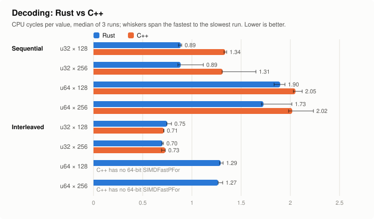
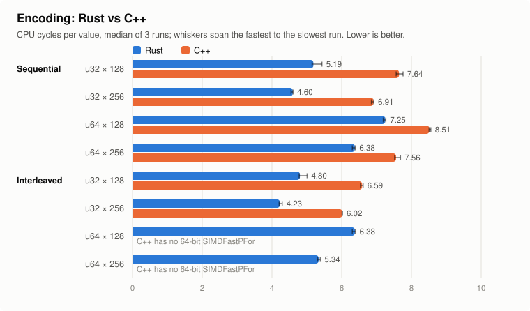

# `FastPFor` for Rust

[](https://github.com/fast-pack/FastPFOR-rs)
[](https://crates.io/crates/fastpfor)
[](https://crates.io/crates/fastpfor)
[](https://docs.rs/fastpfor)
[](https://github.com/fast-pack/FastPFOR-rs/blob/main/LICENSE-APACHE)
[](https://github.com/fast-pack/FastPFOR-rs/actions)
[](https://app.codecov.io/gh/fast-pack/FastPFOR-rs)

A Rust implementation of [FastPFOR](https://github.com/fast-pack/FastPFor) integer compression
([Decoding billions of integers per second through vectorization, 2012](https://arxiv.org/abs/1209.2137)).

* **Pure Rust, `u32` and `u64`:** `FastPFor` codecs for both integer widths, with 128- or 256-value blocks,
  in both wire formats of the C++ library, sequential and interleaved. Both formats have portable and SIMD kernels.
  The Rust code is safe except for one `unsafe` call into the AVX2 kernels, made after runtime CPU feature detection;
  the crate has `#![deny(unsafe_code)]`, with the generated C++ FFI bridge as the only other exemption.
  Without the default `simd` feature (and without `cpp`), the crate itself contains no `unsafe` code at all,
  enforced by `#![forbid(unsafe_code)]`.
* **Optional C++ wrappers:** the `cpp` feature wraps the original [C++ library](https://github.com/fast-pack/FastPFor),
  including its other codecs.

### Choosing a format

The two formats compress equally well, but are **not interchangeable** (see [Wire format](#wire-format)), and differ in
compatibility and speed:

|                             | Sequential (`FastPForSequential*`)                       | Interleaved (`FastPForInterleaved*`)                      |
|-----------------------------|----------------------------------------------------------|-----------------------------------------------------------|
| C++ equivalent              | `FastPFor`, `u32` and `u64`                              | `SIMDFastPFor`, `u32` only                                |
| SIMD on `x86_64`            | AVX2, detected at runtime; portable on older CPUs        | SSE2: every `x86_64` CPU, no detection                    |
| SIMD on `aarch64`           | NEON, little-endian (`u64` wider than 32 bits: portable) | NEON, little-endian                                       |
| `u32` decode (cycles/value) | 0.89                                                     | **0.70-0.75**                                             |
| `u64` decode (cycles/value) | 1.73-1.90                                                | **1.27-1.29**                                             |
| `u32` encode (cycles/value) | 4.60-5.19                                                | **4.23-4.80**                                             |
| `u64` encode (cycles/value) | 6.38-7.25                                                | **5.34-6.38**                                             |
| Code size (`u64`)           | smaller                                                  | about 140 KB more: unrolled kernels for each of 64 widths |

The speeds are CPU cycles per value for 128- and 256-value blocks with the default `Auto` kernels, decoding with
`decode_into`, from one machine (see [Benchmarks](#benchmarks), which also compares them with the C++ library), so
treat them only as relative data points.

The Rust `FastPFor` codecs, scalar **and** `Simd`, write byte-identical streams, and those streams are identical to
the **non-SIMD** C++ `FastPFor` codec (`CppFastPFor128` / `CppFastPFor256`) for both `u32` and `u64`.
`Simd` is a faster implementation of the same format, so encoders and decoders can be mixed freely.
Tests and fuzzing check the scalar codecs byte-for-byte against the C++ library, and `Simd` against scalar, on` x86_64` and `aarch64`.

**In short:** use sequential to stay compatible with existing data and with the C++ `FastPFor`.
Use interleaved to read or write C++ `SIMDFastPFor` data, or for the fastest decoding on any `x86_64` or `aarch64` CPU.

## Wire format

`FastPFor` has two wire formats, sequential and interleaved. They are **not interchangeable**, and decoding one as the
other is not detected: the output is silently wrong. Pick one per data set. Each codec's name says which format it
writes, then the value width in bits and the block size: `FastPFor<Format><value bits>x<block size>`.

| Codec | Format | Values | Block | C++ equivalent |
|---|---|---|---|---|
| `FastPForSequential32x128` | sequential | `u32` | 128 | `FastPFor<4>` (`CppFastPFor128`) |
| `FastPForSequential32x256` | sequential | `u32` | 256 | `FastPFor<8>` (`CppFastPFor256`) |
| `FastPForSequential64x128` | sequential | `u64` | 128 | `FastPFor<4>`, 64-bit path (`CppFastPFor128::encode64`) |
| `FastPForSequential64x256` | sequential | `u64` | 256 | `FastPFor<8>`, 64-bit path (`CppFastPFor256::encode64`) |
| `FastPForInterleaved32x128` | interleaved | `u32` | 128 | `SIMDFastPFor<4>` (`CppSimdFastPFor128`) |
| `FastPForInterleaved32x256` | interleaved | `u32` | 256 | `SIMDFastPFor<8>` (`CppSimdFastPFor256`) |
| `FastPForInterleaved64x128` | interleaved | `u64` | 128 | none: this crate's extension |
| `FastPForInterleaved64x256` | interleaved | `u64` | 256 | none: this crate's extension |

Every Rust codec is byte-identical to its C++ equivalent, and decodes its output. Tests and fuzzing check this
against the C++ library on `x86_64` and `aarch64`.

* **Sequential** is what C++ calls `FastPFor`: each block is bit-packed 32 values at a time into one
  continuous bitstream.
* **Interleaved** is what C++ calls `SIMDFastPFor`: each block is bit-packed 128 values at a time,
  interleaved over the lanes of a 128-bit vector. Value `i` goes to lane `i % 4`, and each lane is packed on its own.
  The bulk of each exception array uses the same layout. The encoder's bit-width choice also differs slightly,
  so the two formats' sizes can differ by a word or two. Neither format pads blocks.
* C++ has no 64-bit `SIMDFastPFor`. The `u64` interleaved format is this crate's extension of the same layout,
  with two 64-bit lanes per vector, so for `u64` there is nothing in C++ to interoperate with.

Despite the C++ names, the format and the implementation are independent: both formats have portable and SIMD
implementations in Rust (see [SIMD](#simd)).

## Usage

### Rust implementation (default)

Pick a codec from the [table above](#wire-format). The codecs handle any input length: they compress whole
blocks with `FastPFor` and the remaining values with `VariableByte`.

```rust
use fastpfor::{AnyLenCodec, FastPForSequential32x256};

let mut codec = FastPForSequential32x256::default();
let input: Vec<u32> = (0..1000).collect();

let mut encoded = Vec::new();
codec.encode(&input, &mut encoded).unwrap();

let mut decoded = Vec::new();
codec.decode(&encoded, &mut decoded, None).unwrap();

assert_eq!(decoded, input);
```

To decode repeatedly, `decode_into` writes into a slice you allocate once and reuse, instead of appending to a `Vec`
(which must be zero-filled first, on every call). It returns how many values it wrote, and fails if they don't fit:

```rust
use fastpfor::{AnyLenCodec, FastPForSequential32x256};

let mut codec = FastPForSequential32x256::default();
let input: Vec<u32> = (0..1000).collect();
let mut encoded = Vec::new();
codec.encode(&input, &mut encoded).unwrap();

let mut decoded = vec![0; 1000];
let n = codec.decode_into(&encoded, &mut decoded).unwrap();
assert_eq!(&decoded[..n], &input[..]);
```

`u64` values work the same way. Those codecs also implement `BlockCodec64` (`encode64` / `decode64`),
the interface the C++ wrappers use for 64-bit values.

```rust
use fastpfor::{AnyLenCodec, FastPForSequential64x256};

let mut codec = FastPForSequential64x256::default();
let input: Vec<u64> = (0..600).map(|i| i * 1_000_000_000).collect();

let mut encoded = Vec::new();
codec.encode(&input, &mut encoded).unwrap();

let mut decoded = Vec::new();
codec.decode(&encoded, &mut decoded, None).unwrap();

assert_eq!(decoded, input);
```

The two formats write different bytes for the same input:

```rust
use fastpfor::{AnyLenCodec, FastPForInterleaved32x256, FastPForSequential32x256};

let input: Vec<u32> = (0..1000).collect();

let mut interleaved = Vec::new();
FastPForInterleaved32x256::default().encode(&input, &mut interleaved).unwrap();

let mut sequential = Vec::new();
FastPForSequential32x256::default().encode(&input, &mut sequential).unwrap();

assert_ne!(interleaved, sequential);
```

For block-aligned input, each codec has a block-only counterpart without the tail, named
`FastPFor<Format>Block<value bits>x<block size>` (for example `FastPForSequentialBlock32x256`), through the
lower-level `BlockCodec` API:

```rust
use fastpfor::{BlockCodec, FastPForSequentialBlock32x256, slice_to_blocks};

type Codec = FastPForSequentialBlock32x256;

let mut codec = Codec::default();
let input: Vec<u32> = (0..512).collect();   // exactly 2 blocks of 256

let (blocks, remainder) = slice_to_blocks::<Codec>(&input);
assert_eq!(blocks.len(), 2);
assert!(remainder.is_empty());

let mut encoded = Vec::new();
codec.encode_blocks(blocks, &mut encoded).unwrap();

let mut decoded = Vec::new();
codec.decode_blocks(&encoded, Some(u32::try_from(blocks.len() * 256).expect("block count fits in u32")), &mut decoded).unwrap();

assert_eq!(decoded, input);
```

### C++ Wrapper (`cpp` feature)

Enable the `cpp` feature in `Cargo.toml`:

```toml
fastpfor = { version = "0.10", features = ["cpp"] }
```

All C++ codecs implement the same `AnyLenCodec` trait (`encode` / `decode`), so
the usage pattern is identical to the Rust examples above — just swap the codec type,
e.g. `cpp::CppFastPFor128::new()`.

**Thread safety:** C++ codec instances have internal state and are **not thread-safe**.
Create one instance per thread or synchronize access externally.

## Crate Features

| Feature        | Default | Description                                                                                  |
|----------------|---------|----------------------------------------------------------------------------------------------|
| `rust`         | **yes** | Pure-Rust implementation — safe code, no build dependencies                                  |
| `simd`         | **yes** | SIMD kernels (AVX2, SSE2, NEON); without it the codecs always use the portable code          |
| `cpp`          | no      | C++ wrapper via CXX — requires a C++14 compiler with SIMD support                            |
| `cpp_portable` | no      | Enables `cpp`, compiles C++ with SSE4.2 baseline (runs on any x86-64 from ~2008+)            |
| `cpp_native`   | no      | Enables `cpp`, compiles C++ with `-march=native` for maximum throughput on the build machine |

The `FASTPFOR_SIMD_MODE` environment variable (`portable` or `native`) can override the SIMD mode at build time.

**Recommendation:** Use `cpp_portable` (not `cpp_native`) for distributable binaries.

### SIMD

The Rust codecs pick the fastest implementation available, and every implementation writes the same bytes, so
the format, value width and block size in the codec's name are the only choices that matter for the data.

* With the default `simd` feature: AVX2 on `x86_64` for the sequential format, selected at runtime, and SSE2 for the
  interleaved one; NEON on little-endian `aarch64` for both.
* Without a SIMD implementation for the target (for example WASM), or on an `x86_64` CPU without AVX2 for the
  sequential format, the codecs use the portable code. So does every target when the `simd` feature is disabled,
  which also leaves this crate with no `unsafe` code (its dependencies, such as `bytemuck`, still have their own):

```toml
fastpfor = { version = "0.10", default-features = false, features = ["rust"] }
```

**Advanced:** benchmarks, tests and low-level code can choose the implementation in code instead.
`FastPForBlock` and `FastPForCodec`, which the named codecs are aliases of, take it as their last type parameter:
`Auto` (the default: the behavior above) or `Portable` (always the portable code).

```rust
use fastpfor::{AnyLenCodec, FastPForCodec, FastPForSequential32x256, Portable, Sequential};

let input: Vec<u32> = (0..1000).collect();

let mut default = Vec::new();
FastPForSequential32x256::default().encode(&input, &mut default).unwrap();

let mut portable = Vec::new();
FastPForCodec::<Sequential, u32, 256, Portable>::default().encode(&input, &mut portable).unwrap();

assert_eq!(default, portable);
```

## Supported Algorithms

### Rust (`rust` feature)

The `FastPFor` codecs are listed under [Wire format](#wire-format). They are `CompositeCodec`s of a block-only
`FastPForBlock` and a `VariableByte` tail; `CompositeCodec` can chain other block and tail codecs as well.

| Codec                  | Description                                                                         |
|------------------------|-------------------------------------------------------------------------------------|
| `FastPForSequential32x*`, `FastPForSequential64x*`   | Sequential format (C++ `FastPFor`), any length, `u32` or `u64`      |
| `FastPForInterleaved32x*`, `FastPForInterleaved64x*` | Interleaved format (C++ `SIMDFastPFor`), any length, `u32` or `u64` |
| `FastPForSequentialBlock*`, `FastPForInterleavedBlock*` | The same, for whole blocks only                                  |
| `FastPForBlock`        | `FastPFor` for whole blocks only, generically: `FastPForBlock<Format, T, BLOCK_SIZE>` |
| `VariableByte`         | Variable-byte encoding, MSB is opposite to protobuf's varint                        |
| `JustCopy`             | No compression; useful as a baseline                                                |

### C++ (`cpp` feature)

All C++ codecs are composite (any-length) and implement `AnyLenCodec` only.
`u64`-capable codecs (`CppFastPFor128`, `CppFastPFor256`, `CppVarInt`) also implement `BlockCodec64` with `encode64` / `decode64`.

| Codec                       | Notes                                                                  |
|-----------------------------|------------------------------------------------------------------------|
| `CppFastPFor128`            | `FastPFor<4> + VByte`, sequential: `FastPForSequential32x128` / `64x128` in Rust |
| `CppFastPFor256`            | `FastPFor<8> + VByte`, sequential: `FastPForSequential32x256` / `64x256` in Rust |
| `CppSimdFastPFor128`        | `SIMDFastPFor<4> + VByte`, interleaved: `FastPForInterleaved32x128` in Rust |
| `CppSimdFastPFor256`        | `SIMDFastPFor<8> + VByte`, interleaved: `FastPForInterleaved32x256` in Rust |
| `CppBP32`                   | Binary packing, 32-bit blocks                                          |
| `CppFastBinaryPacking8`     | Binary packing, 8-bit groups                                           |
| `CppFastBinaryPacking16`    | Binary packing, 16-bit groups                                          |
| `CppFastBinaryPacking32`    | Binary packing, 32-bit groups                                          |
| `CppSimdBinaryPacking`      | SIMD-optimized binary packing                                          |
| `CppPFor`                   | Patched frame-of-reference                                             |
| `CppSimplePFor`             | Simplified `PFor` variant                                              |
| `CppNewPFor`                | `PFor` with improved exception handling                                |
| `CppOptPFor`                | Optimized `PFor`                                                       |
| `CppPFor2008`               | Reference implementation from original paper                           |
| `CppSimdPFor`               | SIMD `PFor`                                                            |
| `CppSimdSimplePFor`         | SIMD `SimplePFor`                                                      |
| `CppSimdNewPFor`            | SIMD `NewPFor`                                                         |
| `CppSimdOptPFor`            | SIMD `OptPFor`                                                         |
| `CppSimple16`               | 16 packing modes in 32-bit words                                       |
| `CppSimple9`                | 9 packing modes                                                        |
| `CppSimple9Rle`             | Simple9 with run-length encoding                                       |
| `CppSimple8b`               | 8 packing modes in 64-bit words                                        |
| `CppSimple8bRle`            | Simple8b with run-length encoding                                      |
| `CppSimdGroupSimple`        | SIMD group-simple encoding                                             |
| `CppSimdGroupSimpleRingBuf` | SIMD group-simple with ring buffer                                     |
| `CppVByte`                  | Standard variable-byte encoding                                        |
| `CppMaskedVByte`            | SIMD masked variable-byte                                              |
| `CppStreamVByte`            | SIMD stream variable-byte                                              |
| `CppVarInt`                 | Standard varint. Also supports `u64`.                                  |
| `CppVarIntGb`               | Group varint                                                           |
| `CppCopy`                   | No compression (baseline)                                              |

## Benchmarks

Rust (the default `Auto` kernels) against the original C++ library, in CPU cycles per value: lower is better.

<picture>
  <source media="(prefers-color-scheme: dark)" srcset="benches/charts/decode-dark.svg">
  
</picture>

<picture>
  <source media="(prefers-color-scheme: dark)" srcset="benches/charts/encode-dark.svg">
  
</picture>

Rust encodes faster in every configuration, in 1.2-1.5× fewer cycles. It also decodes the sequential format faster:
1.5× for `u32` (its AVX2 kernels against the C++ library's scalar ones) and 1.1-1.2× for `u64`. The interleaved
format, where both use SIMD kernels, decodes about as fast in both (0.95-1.04×). C++ has no 64-bit `SIMDFastPFor`,
so interleaved `u64` has no C++ counterpart.

| Format      | Type  | Block | Encode: Rust |  C++ | Rust speedup | Decode: Rust |  C++ | Rust speedup |
|-------------|-------|-------|-------------:|-----:|-------------:|-------------:|-----:|-------------:|
| Sequential  | `u32` | 128   |         5.19 | 7.64 |        1.47× |         0.89 | 1.34 |        1.51× |
| Sequential  | `u32` | 256   |         4.60 | 6.91 |        1.50× |         0.89 | 1.31 |        1.48× |
| Sequential  | `u64` | 128   |         7.25 | 8.51 |        1.17× |         1.90 | 2.05 |        1.08× |
| Sequential  | `u64` | 256   |         6.38 | 7.56 |        1.19× |         1.73 | 2.02 |        1.17× |
| Interleaved | `u32` | 128   |         4.80 | 6.59 |        1.37× |         0.75 | 0.71 |        0.95× |
| Interleaved | `u32` | 256   |         4.23 | 6.02 |        1.42× |         0.70 | 0.73 |        1.04× |
| Interleaved | `u64` | 128   |         6.38 |  n/a |          n/a |         1.29 |  n/a |          n/a |
| Interleaved | `u64` | 256   |         5.34 |  n/a |          n/a |         1.27 |  n/a |          n/a |

"Rust speedup" is C++ cycles divided by Rust cycles; below 1 means C++ is faster.

**What is compared:** the same data and work on both sides: the sequential streams are byte-identical between Rust and
C++ (the tests check this), and the interleaved ones use the same format. A few differences remain, and are part of
what each library does rather than of the benchmark:

* **Both decode into an output buffer allocated once and reused**, which is how the C++ library is called. In Rust that
  is `FastPForCodec::decode_into`. `AnyLenCodec::decode` instead appends to a `Vec`, which safe Rust must zero-fill
  before writing into it, on every call: it decodes 20-33% slower than `decode_into` in this benchmark.
* **Rust validates its input.** It checks every offset, count, and exception position of the stream and returns an
  error for corrupted data. The C++ library trusts its input.
* **The sequential format has no SIMD kernels in C++.** Rust's `Auto` kernels use AVX2 for it; the `Portable` ones
  are the scalar counterpart.
* **The C++ library frees its scratch buffers after every call** and allocates them again in the next one; the Rust
  codec keeps its buffers between calls.

**How this was measured:** three runs of `just bench perf` (hardware counters through `perf stat`, pinned to one core)
on an Intel i9-10885H laptop. Both languages are built for that CPU: C++ with `-march=native`, Rust with
`-C target-cpu=native`. Each side decodes into an output buffer sized once and reused (`decode_into` for Rust); the
C++ codecs are called directly, not through the crate's `cpp` wrappers, whose zero-filling of an oversized output
vector on every call would count against C++. Each run
encodes and decodes 131,172 values (two 65,536-value pages plus a partial block), a mix of small, clustered, ascending,
sparse (many exceptions), and large values; for `u64`, also values wider than 32 bits. The charts show the median run,
with whiskers from the fastest to the slowest one; single runs were within 26% of the median.

* `just bench perf [mode] [cpu]` counts cycles and instructions with the CPU's hardware counters. It needs
  `kernel.perf_event_paranoid` of 2 or lower, and explains how to set it if not. `mode` is how both languages are
  built: `native` for this CPU, or `portable`. With `--save <file>` it keeps the raw counts, and
  `benches/charts/render.py <files>` redraws the charts from them.
* `just bench instructions [mode]` counts instructions with valgrind instead: slower, but exact, and needs no kernel
  setting. Both accept `--filter <case>`, e.g. `--filter Interleaved-u32-128`.
* CI runs the valgrind benchmark on every pull request, for the pull request and its base commit, and posts the
  results as a PR comment.

## Build Requirements

- **Rust feature** (`rust`, the default): no additional dependencies.
- **C++ feature** (`cpp`): requires a C++14-capable compiler with SIMD intrinsics.
  See [FastPFor C++ requirements](https://github.com/fast-pack/FastPFor?tab=readme-ov-file#software-requirements).

### Linux

The default GitHub Actions runner has all needed dependencies.

For local development:

```bash
# This list may be incomplete
sudo apt-get install build-essential
```

On ARM/aarch64, the C++ library uses native NEON intrinsics and needs no extra packages.

### macOS

The Xcode command line tools are enough, on both Intel and Apple Silicon.

## Development

This project uses [just](https://github.com/casey/just#readme) as a task runner:

```bash
cargo install just   # install once
just                 # list available commands
just test            # run all tests
```

## License

Licensed under either of

* Apache License, Version 2.0 ([LICENSE-APACHE](LICENSE-APACHE) or <https://www.apache.org/licenses/LICENSE-2.0>)
* MIT license ([LICENSE-MIT](LICENSE-MIT) or <https://opensource.org/licenses/MIT>)
  at your option.

### Contribution

Unless you explicitly state otherwise, any contribution intentionally
submitted for inclusion in the work by you, as defined in the
Apache-2.0 license, shall be dual-licensed as above, without any
additional terms or conditions.
